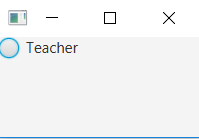
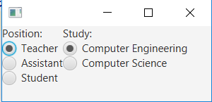
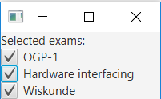


---

## Other basic components

In other chapters we have seen some basic JavaFX controls such as `Button`, `Label` and `TextField`. There are many more basic UI controls. In this chapter we will explain a few of them.

### RadioButtons

A [`RadioButton`](https://docs.oracle.com/javase/8/javafx/api/javafx/scene/control/RadioButton.html) is a button that can be selected or not selected. The `RadioButton` cannot be "deselected" once it's selected. To deselect it, select another radiobutton in the same radiobutton group

You create a `RadioButton` using its constructor. Here is a `RadioButton` instantiation example:

```java
RadioButton teacherRadioButton = new RadioButton("Teacher");
```

The `String` passed as parameter to the `RadioButton` constructor is displayed next to the `RadioButton`.

To make a `RadioButton` visible you must add it to the scene graph of your application. This means adding the `RadioButton` to a `Scene`, or as child of a layout which is attached to a `Scene` object.

Here is an example that attaches a `RadioButton` to the scene:

```java
public void start(Stage stage) {
    RadioButton teacherRadioButton = new RadioButton("Teacher");

    HBox hbox = new HBox(teacherRadioButton);

    Scene scene = new Scene(hbox, 200, 100);
    stage.setScene(scene);
    stage.show();
}
```

The application resulting from running this example looks like this:



The `RadioButton` class has a method named `isSelected` which lets you determine if the `RadioButton` is selected or not. The `isSelected` method returns a boolean with the value true if the `RadioButton` is selected, and false if not. Here is an example:

```java
boolean isSelected = teacherRadioButton.isSelected();
```

#### Combining RadioButtons in groups

Radio buttons are typically used in a group to present several mutually exclusive options. Groups are defined by using the object [`ToggleGroup`](https://docs.oracle.com/javase/8/javafx/api/javafx/scene/control/ToggleGroup.html) from the JavaFX library. When `ToggleGroup` is used, only one radio button inside the group can be selected. 

In the example above we create two groups of RadioButtons in order to have two inputs. The following code is used

```java
public void start(Stage stage) {

    // Position section
    ToggleGroup positionToggleGroup = new ToggleGroup();
    Label positionLabel = new Label("Position:");

    RadioButton teacherRB = new RadioButton("Teacher");
    teacherRB.setToggleGroup(positionToggleGroup);
    teacherRB.setSelected(true);

    RadioButton assistantRB = new RadioButton("Assistant");
    assistantRB.setToggleGroup(positionToggleGroup);

    RadioButton studentRB = new RadioButton("Student");
    studentRB.setToggleGroup(positionToggleGroup);

    VBox positionVBox = new VBox();
    positionVBox.getChildren().addAll(positionLabel, teacherRB, assistantRB, studentRB);

    // Study section
    ToggleGroup studyToggleGroup = new ToggleGroup();
    Label studyLabel = new Label("Study:");

    RadioButton compEngRB = new RadioButton("Computer Engineering");
    compEngRB.setToggleGroup(studyToggleGroup);
    compEngRB.setSelected(true);

    RadioButton computerScienceRB = new RadioButton("Computer Science");
    computerScienceRB.setToggleGroup(studyToggleGroup);

    VBox studyVBox = new VBox();
    studyVBox.getChildren().addAll(studyLabel, compEngRB, computerScienceRB);

    // Add everything towards the UI
    BorderPane borderPane = new BorderPane();
    HBox hBox = new HBox();
    hBox.getChildren().addAll(positionVBox, studyVBox);
    borderPane.setCenter(hBox);

    Scene firstScene = new Scene(borderPane);
    stage.setScene(firstScene);
    stage.show();
}
```

The application resulting from running this example looks like this:



The selected radio button can be found by using the method `isSelected` on the object `RadioButton`, which returns a `Boolean` value, or the selected object `RadioButton` can be found using the method `getSelectedToggle` on the object `ToggleGroup`. If no RadioButton is selected the `getSelectedToggle` method returns null .

```java
RadioButton selectedGroup = (RadioButton)studyToggleGroup.getSelectedToggle();
System.out.println(selectedGroup.getText());
```

It's also possible to add `EventHandler` to see if the selection is changed like in the example below, which displays a pop-up when *Computer Engineering* is selected.

```java
compEngRB.setOnAction(e -> {
    if (compEngRB.isSelected()) {
        new Alert(Alert.AlertType.INFORMATION, "TI 4 all!", ButtonType.OK).show();
    }
});
```

But sometimes it is more convenient to create an `EventHandler` on the `ToggleGroup`. This allows you to only create one `EventHandler` for the `ToggleGroup`. You can implement it using the following code

```java
studyToggleGroup.selectedToggleProperty().addListener(
                (ov, old_toggle, new_toggle) -> {
                    if (studyToggleGroup.getSelectedToggle() != null) {
                        String text = ((RadioButton)studyToggleGroup.getSelectedToggle()).getText();
                    }
                });
```


{: .exercises }

### 17.2. CheckBoxes

A [`CheckBox`](https://docs.oracle.com/javase/8/javafx/api/javafx/scene/control/CheckBox.html) is a button which can be in two different states: *Selected and not selected*. The `CheckBox` control is represented by the class `javafx.scene.control.CheckBox`.

You create a `CheckBox` control via the `CheckBox` constructor. Here is a `CheckBox` instantiation example:

```java
CheckBox greenCheckBox = new CheckBox("Green");
```

The `String` passed to the `CheckBox` constructor is displayed next to the `CheckBox` control.

To make a `CheckBox` control visible you must add it to the scene graph of your application. That means adding the `CheckBox` control to a `Scene` object, or to some layout component which is itself added to a `Scene` object.

Here is an example showing how to add a `CheckBox` to the scene graph:

```java
public void start(Stage stage) {

    // Checkboxes
    Label examLabel = new Label("Selected exams:");
    CheckBox ogp1CheckBox = new CheckBox("OGP-1");
    CheckBox hwiCheckbox = new CheckBox("Hardware interfacing");
    CheckBox wiskundeCheckBox = new CheckBox("Wiskunde");

    VBox selectedCourse = new VBox();
    selectedCourse.getChildren().addAll(examLabel, ogp1CheckBox, hwiCheckbox, wiskundeCheckBox);

    Scene firstScene = new Scene(selectedCourse);
    stage.setScene(firstScene);
    stage.show();
}
```

The application resulting from running this code looks like this:



The method `isSelected` can be used to check if the Checkbox is selected. It's also possible to add `EventHandler` to see if the selection is changed like in the example below

```java
wiskundeCheckBox.setOnAction(e -> {
    if (wiskundeCheckBox.isSelected()) {
        new Alert(Alert.AlertType.INFORMATION, "Math 4 all!", ButtonType.OK).show();
    }
});
```
