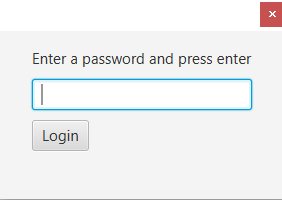
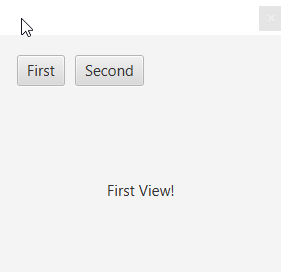


---

## Multiple views inside a program

The Graphical user interfaces we developed so far, have just one view. In this chapter we will teach you how to create an application with more then one view.

Generally speaking, the views are created using a Scene element, between which the transition takes place through connected events to the application. In the example below, two distinct Scene objects have been created, each with its own content and content-related event. Below, the Scene objects do not have a separate interface component (eg BorderPane), but each Scene object has exactly one user interface component.

```java
import javafx.application.Application;
import javafx.scene.Scene;
import javafx.scene.control.Button;
import javafx.stage.Stage;

public class EvenTheBestApplication extends Application {

    @Override
    public void start(Stage stage) {

        Button nextButton = new Button("Next ..");
        Button backButton = new Button(".. Back.");

        Scene firstScene = new Scene(nextButton);
        Scene secondScene = new Scene(backButton);

        nextButton.setOnAction((event) -> {
            stage.setScene(secondScene);
        });

        backButton.setOnAction((event) -> {
            stage.setScene(firstScene);
        });

        stage.setScene(firstScene);
        stage.show();
    }

    public static void main(String[] args) {
        launch(EvenTheBestApplication.class);
    }
}
```

Launching the above application creates a user interface where you can switch from one view to another by pressing the button.


{: .exercises }

### Layout of each view

Let's look at two separate views. In the first view, the user is asked to enter a password. If the user writes the wrong password, the wrong password will be reported. If the user writes the correct password, the program will switch to the next view. The Program activity is as follows.



```java
import javafx.application.Application;
import javafx.geometry.Insets;
import javafx.geometry.Pos;
import javafx.scene.Scene;
import javafx.scene.control.Button;
import javafx.scene.control.Label;
import javafx.scene.control.PasswordField;
import javafx.scene.layout.GridPane;
import javafx.scene.layout.StackPane;
import javafx.stage.Stage;

public class EncryptedApplication extends Application {

    @Override
    public void start(Stage stage) throws Exception {

        // 1. Creating a password for the password query

        // 1.1 creating the components to be used
        Label loginLabel = new Label("Enter a password and press enter");
        PasswordField passwordText = new PasswordField();
        Button loginButton = new Button("Login");
        Label errorLabel = new Label("");

        // 1.2 creating layout and adding components to it
        GridPane gridPane = new GridPane();

        gridPane.add(loginLabel, 0, 0);
        gridPane.add(passwordText, 0, 1);
        gridPane.add(loginButton, 0, 2);
        gridPane.add(errorLabel, 0, 3);

        // 1.3 Style the layout
        gridPane.setPrefSize(300, 180);
        gridPane.setAlignment(Pos.CENTER);
        gridPane.setVgap(10);
        gridPane.setHgap(10);
        gridPane.setPadding(new Insets(20, 20, 20, 20));

        // 1.4 creating the view itself and setting the layout to it
        Scene loginScene = new Scene(gridPane);

        // 2. Creating a view to display the welcome text
        Label welcomeLabel = new Label("Welcome, this is where it starts!");

        StackPane welcomeStackPane = new StackPane();
        welcomeStackPane.setPrefSize(300, 180);
        welcomeStackPane.getChildren().add(welcomeLabel);
        welcomeStackPane.setAlignment(Pos.CENTER);

        Scene welcomeScene = new Scene(welcomeStackPane);


        // 3. The event handler is added to the password bar button
        // the view is changed if the password is correct
        loginButton.setOnAction((event) -> {
            if (!passwordText.getText().trim().equals("password")) {
                errorLabel.setText("Unkown password!");
                return;
            }

            stage.setScene(welcomeScene);
        });

        stage.setScene(loginScene);
        stage.show();
    }

    public static void main(String[] args) {
        launch(EncryptedApplication.class);
    }
}
```

The example uses the `setPrefSize` and `setAlignment` methods provided by both `GridPane` and `StackPane`. With method, `setPrefSize` will give you the size you want to set up, and with the method, `setAlignment` you can set alligntment the components used in a layout. `Pos.CENTER` sets the layout in the center of the view.


{: .exercises }

### The same layout with views

Depending on the application's use, sometimes a permanent view of the application is required, where some part will be changed when needed. Programs that offer some kind of menu typically work this way.

In the example below, an application has been created that includes a main menu and a variable content area. The content of the Variable Content area changes by pressing the buttons in the Main Menu.

```java
import javafx.application.Application;
import javafx.geometry.Insets;
import javafx.geometry.Pos;
import javafx.scene.Scene;
import javafx.scene.control.Button;
import javafx.scene.control.Label;
import javafx.scene.layout.BorderPane;
import javafx.scene.layout.HBox;
import javafx.scene.layout.StackPane;
import javafx.stage.Stage;

public class ExampleApplication extends Application {

    @Override
    public void start(Stage stage) throws Exception {

        // 1. Creating the main level layout
        BorderPane borderPane = new BorderPane();

        // 1.1. Creating the main menu layout
        HBox mainMenuHbox = new HBox();
        mainMenuHbox.setPadding(new Insets(20, 20, 20, 20));
        mainMenuHbox.setSpacing(10);

        // 1.2. Creating the buttons
        Button firstButton = new Button("First");
        Button secondButton = new Button("Second");

        // 1.3. Add the buttons to the menu
        mainMenuHbox.getChildren().addAll(firstButton, secondButton);
        borderPane.setTop(mainMenuHbox);

        // 2. Create sub-views and connect them to the menu buttons
        // 2.1. Creating sub-views - here layouts
        StackPane firstStackPane = createStackPane("First View!");
        StackPane secondStackPane = createStackPane("Second View!");

        // 2.2. Attach the sub-views to the buttons. Pressing a button will change the bottom view.
        firstButton.setOnAction((event) -> borderPane.setCenter(firstStackPane));
        secondButton.setOnAction((event) -> borderPane.setCenter(secondStackPane));

        // 2.3. First we show the first view
        borderPane.setCenter(firstStackPane);

        // 3. Create a main view and set the main level borderPane to it
        Scene mainView = new Scene(borderPane);

        // 4. Showing application
        stage.initStyle(StageStyle.UTILITY);
        stage.setScene(mainView);
        stage.show();
    }

    private StackPane createStackPane(String text) {
        StackPane stackPane = new StackPane();
        stackPane.setPrefSize(300, 180);
        stackPane.getChildren().add(new Label(text));
        stackPane.setAlignment(Pos.CENTER);

        return stackPane;
    }

    public static void main(String[] args) {
        launch(ExampleApplication.class);
    }
}
```

The application works as follows:




{: .exercises }

### Slightly larger application: Vocabulary workout

Outlines the application for foreign word training. The application provides the user with two functions: entering words and their translations and training. Four separate classes are created for the application: the first class provides the core logic functionality of the application, i.e. the maintenance of the dictionary, the second and third class contain feed view and training views, and the fourth class includes the application's main menu and the functionality required to launch the application.

#### Dictionary

The dictionary is implemented using an `ArrayList` and a `HashMap`. The `HashMap` contains a word and their translation. The `ArrayList` is used for selecting a random word towards to user. The class contains methods for adding translation, searching for a specific translation, and randomly providing a word for translation.

```java
import java.util.ArrayList;
import java.util.HashMap;
import java.util.List;
import java.util.Map;
import java.util.Random;

public class WordDictonairy {

    private List<String> words;
    private Map<String, String> translations;

    public WordDictonairy() {
        this.words = new ArrayList<>();
        this.translations = new HashMap<>();

        add("sana", "word");
    }

    public String get(String sana) {
        return this.translations.get(sana);
    }

    public void add(String word, String translation) {
        if (!this.translations.containsKey(word)) {
            this.words.add(word);
        }

        this.translations.put(word, translation);
    }

    public String nextWord() {
        Random random = new Random();
        return this.words.get(random.nextInt(this.words.size()));
    }
}
```

The dictionary could also be implemented in such a way that the word sniffing would always create a list of the keys to the ditches spreadsheet. In that case there would be no need for the word list. However, this would affect the efficiency of the application (or, at least, it would have affected before the turn of the millennium - today machines are already slightly faster ...).

#### Entering words

Next, we create the functionality that is needed to enter words. To enter words, we need a reference to the `WordDictionary` object and the text fields for the word and the translation. The `GridPane` layout is well suited for this layout. Create a class `WordView`  that provides the method `getView`, which creates a view for entering words. The method returns a reference to the [Parent](https://docs.oracle.com/javase/8/javafx/api/javafx/scene/Parent.html) type object. `Parent` is the upper class of the other components used for layout, so any class used for the layout can be represented as a parent object.

The class also specifies the user interface button functionality. When a user presses the button, the word pair is added to the dictionary. At the same time, the text fields are cleared to enter the next word.

```java
import javafx.geometry.Insets;
import javafx.geometry.Pos;
import javafx.scene.Parent;
import javafx.scene.control.Button;
import javafx.scene.control.Label;
import javafx.scene.control.TextField;
import javafx.scene.layout.GridPane;

public class WordView {

    private WordDictonairy wordDictonairy;

    public WordView(WordDictonairy wordDictonairy) {
        this.wordDictonairy = wordDictonairy;
    }

    public Parent getView() {
        GridPane gridPane = new GridPane();

        Label wordLabel = new Label("Word");
        TextField wordText = new TextField();
        Label translationLabel = new Label("Translation");
        TextField translationText = new TextField();

        gridPane.setAlignment(Pos.CENTER);
        gridPane.setVgap(10);
        gridPane.setHgap(10);
        gridPane.setPadding(new Insets(10, 10, 10, 10));

        Button addWordButton = new Button("Add word");

        gridPane.add(wordLabel, 0, 0);
        gridPane.add(wordText, 0, 1);
        gridPane.add(translationLabel, 0, 2);
        gridPane.add(translationText, 0, 3);
        gridPane.add(addWordButton, 0, 4);

        addWordButton.setOnMouseClicked((event) -> {
            String word = wordText.getText();
            String translation = translationText.getText();

            wordDictonairy.add(word, translation);

            wordText.clear();
            translationText.clear();
        });

        return gridPane;
    }
}
```

#### Word Trainig

Then create the required functionality for training. For training, we also need a reference to the `WordDictionary` object so that we can search for words for practiced and check the correctness of the translations entered by the user. In addition to the dictionary, we need a text to ask the word, and a text field where the user can input the translation. `GridPane` is well suited for this.

```java
import javafx.geometry.Insets;
import javafx.geometry.Pos;
import javafx.scene.Parent;
import javafx.scene.control.Button;
import javafx.scene.control.Label;
import javafx.scene.control.TextField;
import javafx.scene.layout.GridPane;

public class TrainingView {

    private WordDictonairy wordDictonairy;
    private String word;

    public TrainingView(WordDictonairy wordDictonairy) {
        this.wordDictonairy = wordDictonairy;
        this.word = wordDictonairy.nextWord();
    }

    public Parent getView() {
        GridPane gridPane = new GridPane();

        Label translateLabel = new Label("Translate the word '" + this.word + "'");
        TextField translationText = new TextField();

        gridPane.setAlignment(Pos.CENTER);
        gridPane.setVgap(10);
        gridPane.setHgap(10);
        gridPane.setPadding(new Insets(10, 10, 10, 10));

        Button checkButton = new Button("Check");

        Label feedbackLabel = new Label("");

        gridPane.add(translateLabel, 0, 0);
        gridPane.add(translationText, 0, 1);
        gridPane.add(checkButton, 0, 2);
        gridPane.add(feedbackLabel, 0, 3);

        checkButton.setOnMouseClicked((event) -> {
            String translation = translationText.getText();
            if (wordDictonairy.get(word).equals(translation)) {
                feedbackLabel.setText("Right!");
            } else {
                feedbackLabel.setText("Wrong! the word '" + word + "' means '" + wordDictonairy.get(word) + "'.");
                return;
            }

            this.word = this.wordDictonairy.nextWord();
            translateLabel.setText("Translate the word '" + this.word + "'");
            translationText.clear();
        });

        return gridPane;
    }
}
```

#### Traning Application

Training app and stack the above categories together to provide the application menu. The training app is structured as follows.

```java
import javafx.application.Application;
import javafx.geometry.Insets;
import javafx.scene.Scene;
import javafx.scene.control.Button;
import javafx.scene.layout.BorderPane;
import javafx.scene.layout.HBox;
import javafx.stage.Stage;

public class TrainingApplication extends Application {

    private WordDictonairy wordDictonairy;

    @Override
    public void init() throws Exception {
        // 1. Creating the dictionary used by the application
        this.wordDictonairy = new WordDictonairy();
    }

    @Override
    public void start(Stage stage) throws Exception {
        // 2. Creating views ("sub-views")
        TrainingView trainingView = new TrainingView(wordDictonairy);
        WordView wordView = new WordView(wordDictonairy);

        // 3. Creating the main level layout
        BorderPane borderPane = new BorderPane();

        // 3.1. The main level layout menu is created
        HBox hBox = new HBox();
        hBox.setPadding(new Insets(20, 20, 20, 20));
        hBox.setSpacing(10);

        // 3.2. Creating the buttons
        Button addWordsButton = new Button("Add words");
        Button trainButton = new Button("Train");

        // 3.3. Add buttons to the menu
        hBox.getChildren().addAll(addWordsButton, trainButton);
        borderPane.setTop(hBox);

        // 4. Attach the sub-views to the buttons. Pressing a button will change the bottom view.
        addWordsButton.setOnAction((event) -> borderPane.setCenter(wordView.getView()));
        trainButton.setOnAction((event) -> borderPane.setCenter(trainingView.getView()));

        // 5. The word view is displayed first
        borderPane.setCenter(wordView.getView());

        // 6. Create the main view and set the main level layout to it
        Scene scene = new Scene(borderPane, 400, 300);

        // 7. Showing Application
        stage.setScene(scene);
        stage.show();
    }

    public static void main(String[] args) {
        launch(TrainingApplication.class);
    }
}
```


{: .exercises }